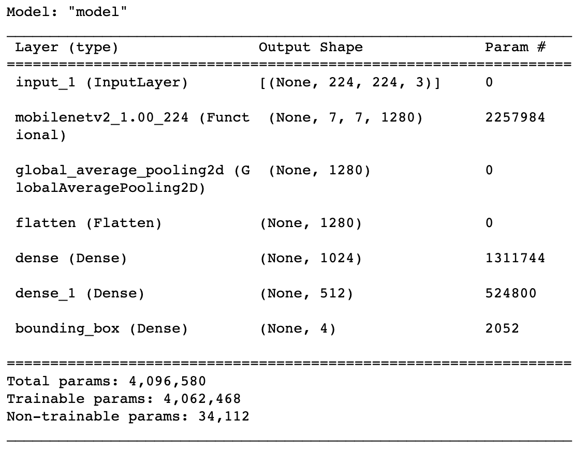
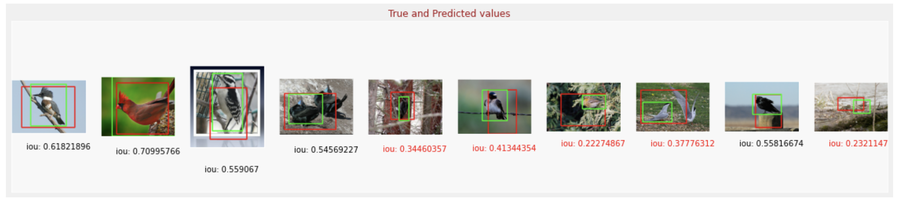

# Object detection of birds

## Table of Contents
* [General Info](#general-information)
* [Results](#Results)
* [Technologies Used](#technologies-used)
* [Contact](#contact)
<!-- * [License](#license) -->

## General Information
- The goal of the project is to train a deep learning model to perform object detection of birds.
- I will be performing transfer learning with MobileNet V2
- I'll also use pretrained 'imagenet' weights as a starting point for further training. These weights are also readily available
  

- The dataset is Caltech Birds - 2010 dataset.

## Results

<!-- If you have screenshots you'd like to share, include them here. -->

## Technologies Used
- Python
- Tensorflow
- Pandas
- Matplotlib
- Keras

## Contact
Created by [Miralireza Nabavi](anabavib@asu.edu) - feel free to contact me!
